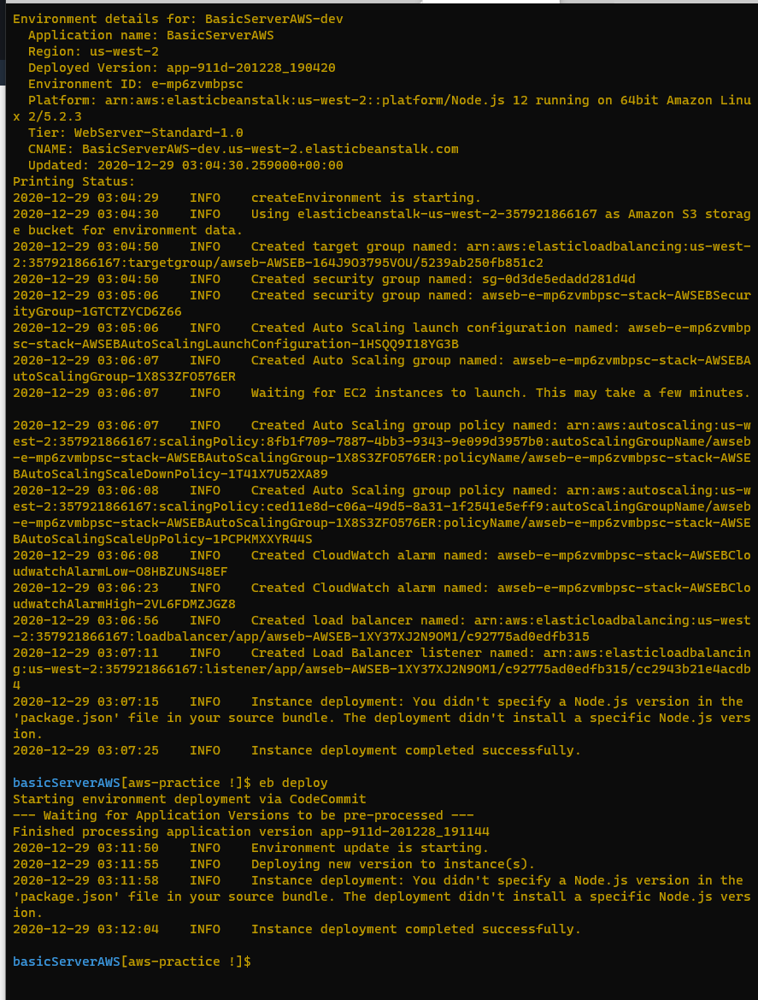

# basicServerAWS

## Links to Deployed Sites

+ [GUI deploy](http://basicserveraws-env.eba-3bqmyej8.us-west-2.elasticbeanstalk.com/)
+ [CLI deploy](http://basicserveraws-dev.us-west-2.elasticbeanstalk.com/)

### Process

+ To deploy the GUI deployment you zip the file including the server.js, package.json, and /public file.
+ CLI Went into the file
+ In the command line: 
  + eb init and followed instructions
  + eb create to make new app
    + followed more instructions
    + eb deploy which opens a webpage with your site!
+ Two deployed AWS environment pages showed and it was deployed!

### Errors I encountered

```
- Starting environment deployment via CodeCommit ERROR: TypeError - expected str, bytes or os.PathLike object, not NoneType

- Could not push code to the CodeCommit repository:
ERROR: CommandError - An error occurred while handling git command.
Error code: 128 Error: 'NoneType' object has no attribute 'secret_key'
fatal: unable to access 'https://git-codecommit.us-west-2.amazonaws.com/v1/repos/basicServerAWS/': The requested URL returned error: 403
```

+ 